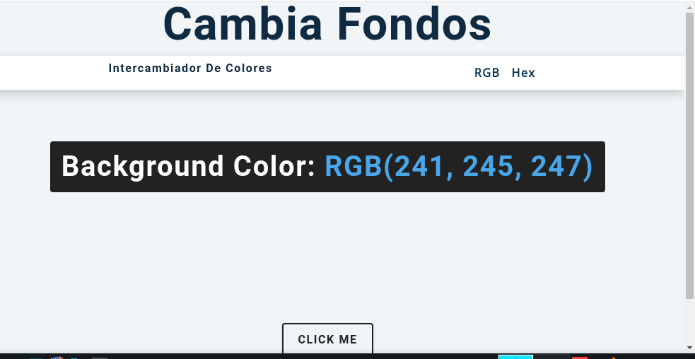

# Coloreador-de-Fondos-

Coloreador-de-Fondos es una aplicación web sencilla para cambiar el color de fondo de la página con HTML, CSS y JavaScript.

## Descripción

- `Colorea Fondo/`: versión inicial del proyecto.
- `final/`: versión final con mejoras y correcciones.
- `fondo.png`: imagen local usada en este README como vista previa.

## Funcionalidades

- Entrada de color hexadecimal.
- Cambio de fondo en tiempo real.
- Interfaz simple para aprender JavaScript DOM.

## Cómo usar

1. Abre `final/index.html` o `Colorea Fondo/index.html` en tu navegador.
2. Introduce un color en formato hexadecimal, por ejemplo `#ff7733`.
3. Observa cómo cambia el fondo de la página.

## Estructura

- `index.html` - página principal.
- `styles.css` - estilos del proyecto.
- `app.js` / `hex.js` - lógica de cambio de color.

## Enlaces

- Demo en línea: [https://cambiafondos.netlify.app/](https://cambiafondos.netlify.app/)
